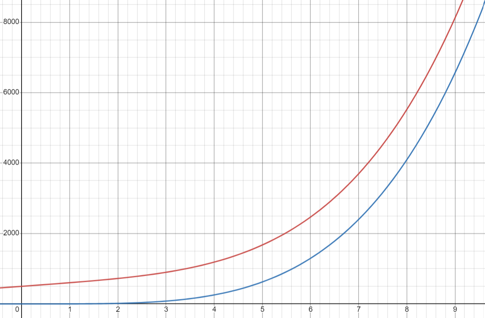
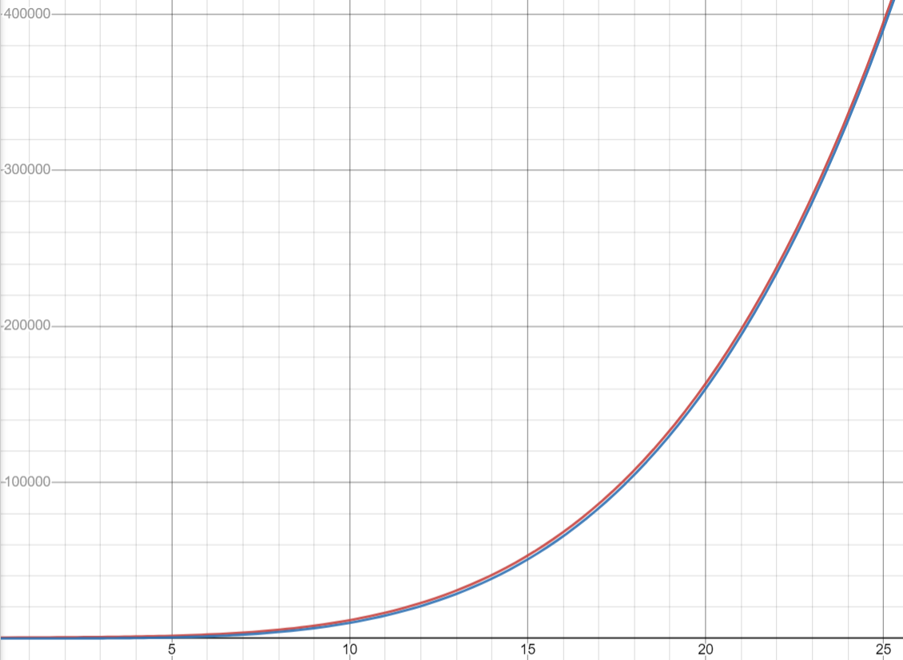
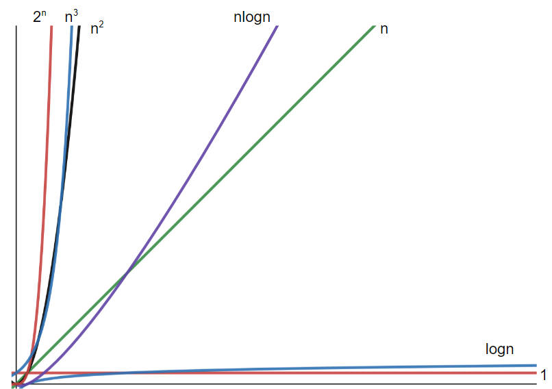
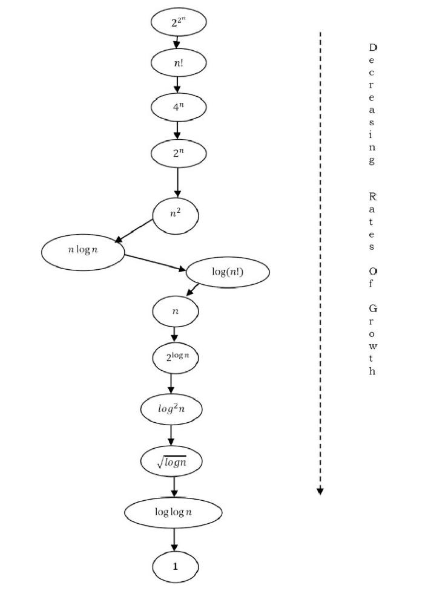
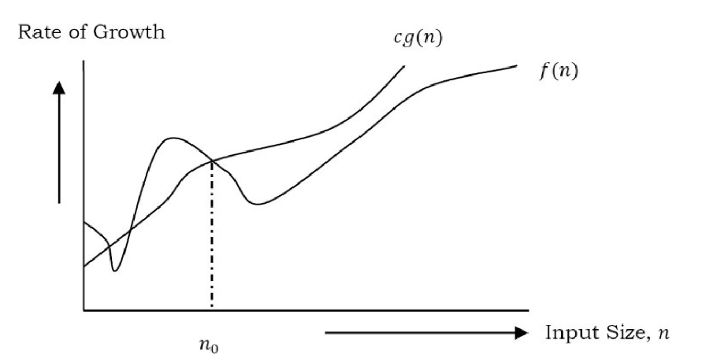

# 2.1 Comparing Algorithms

## How to Compare Algorithms

In order to compare algorithms, we need to define a few _objective_ measures.

**Execution times?** _Not a good measure_ since execution time depends heavily on the computer being used.

**Number of statements executed?** _Not a good measure_ since that will depend on the programming language being used and the style of the individual programmer.

#### Ideal Solution

We will express the running time of a given algorithm as a **function of the input size** (ie. f(n)) and compare those different functions corresponding to running times.

This kind of comparison is independent of machine time, programming style, etc.

### Rate of Growth

The rate at which the running time increases as a function of input is called _<mark style="color:red;">rate of growth</mark>_.

Let's say you're going to the store to buy a new gaming computer and a candy bar.

If your friend sees you there and asks what you're buying, then in general, you say _buying a computer_.

This is because the cost of the computer is high compared to the cost of the candy bar.

> Total Cost = cost\_of\_computer + cost\_of\_candybar
>
> Total Cost ≈ cost\_of\_computer (approximation)

We can ignore the relatively insignificant cost of the candy bar.

In general, for a given function we can ignore low order terms that are relatively insignificant (for large values of input size, n).

For example: $$n^4+2n^2+100n+500≈n^4$$&#x20;

 

As you can see in the two images above, when n is relatively small (n<10) the two functions appear similar, but pretty far apart.  However, as n increases we can see that given how _large_ the output values get, the two functions are relatively close together. &#x20;

### Commonly Used Growth Rates




| Time Complexity | Name               | Example                                         |
| --------------- | ------------------ | ----------------------------------------------- |
| 1               | Constant           | Adding an element to the front of a linked list |
| log n           | Logarithmic        | Finding an element in a sorted array            |
| n               | Linear             | Finding an element in an unsorted array         |
| n log n         | Linear Logarithmic | Sorting n items with Mergesort                  |
| $$n^2$$​        | Quadratic          | Shortest path between two nodes in a graph      |
| $$n^3$$​        | Cubic              | Matrix multiplication                           |
| $$2^n$$         | Exponential        | Towers of Hanoi                                 |











### Types of Analysis

* Worst case
  * Defines the input for which the algorithm takes the longest
* Best case
  * Defines the input for which the algorithm takes the least time
* Average case
  * Provides a prediction about the running time of the algorithm
  * Assumes the input is random

## Big-O Notation

This notation gives the <mark style="color:red;">upper bound</mark> of the given function.

If the run time of a given algorithm is $$f(n)$$, Big O is represented as $$f(n)=O(g(n))$$.

For example, if $$f(n)=n^4+100n^2+10n+50$$ is the given algorithm, then $$n^4$$ is $$g(n)$$.

That means $$g(n)$$ gives the approximate rate of growth for $$f(n)$$ at larger values of $$n$$.

### Big O Definition

$$O(g(n)) = \{ f(n) :$$​ there exist positive constants $$c$$ and $$n_o$$ such that $$0 ≤ f(n) ≤ cg(n)$$ for all $$n ≥ n_0\}$$

Our goal is to give the **smallest** rate of growth $$g(n)$$ which is greater than or equal to the given algorithms' rate of growth $$f(n)$$.  We ignore lower values of $$n$$ (values before$$n_0$$).  $$n_0$$ is called the _threshold_ for the function.&#x20;
